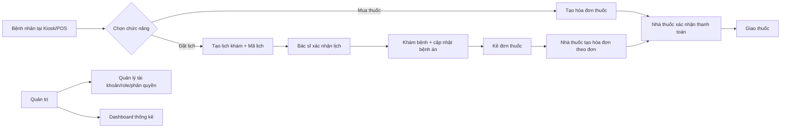
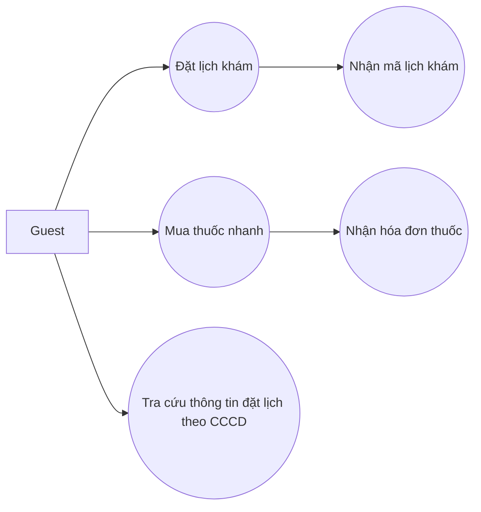
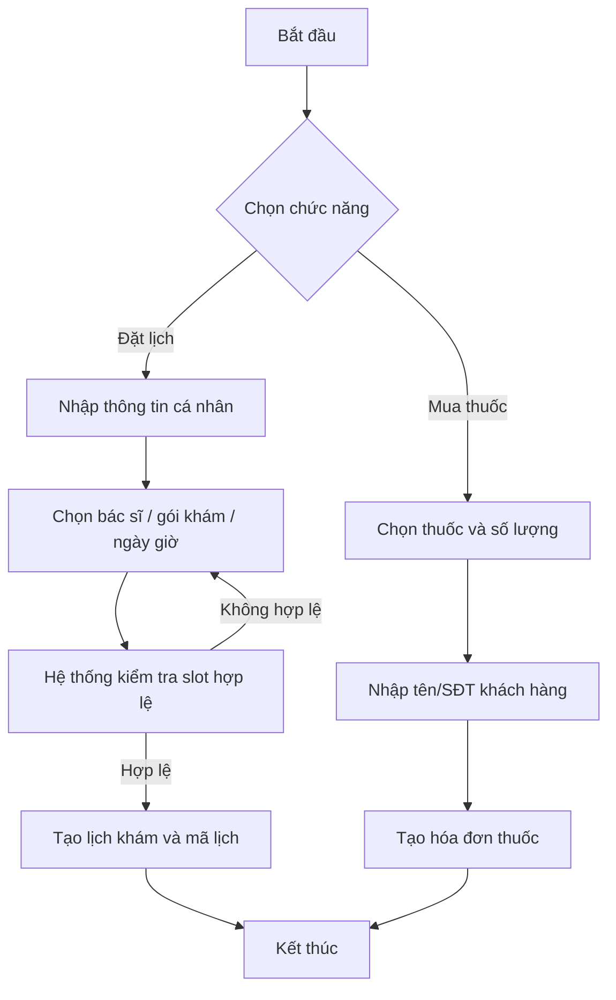
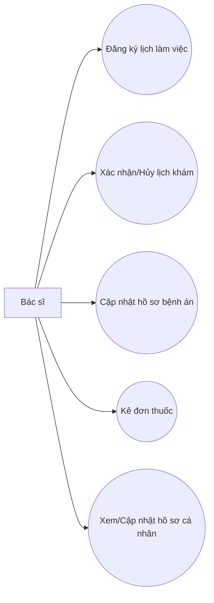
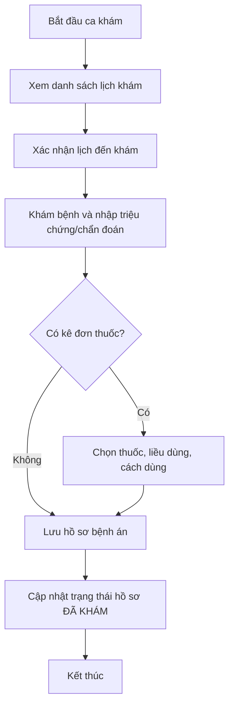
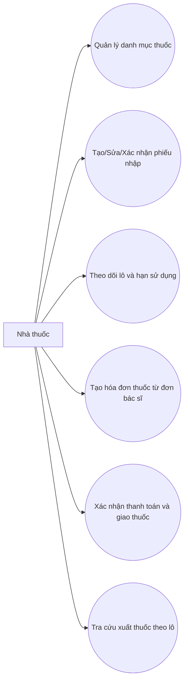
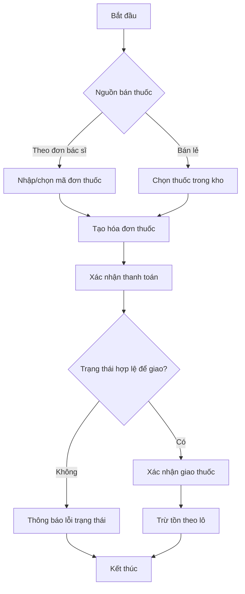
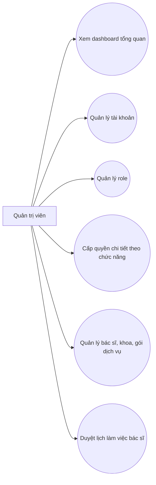
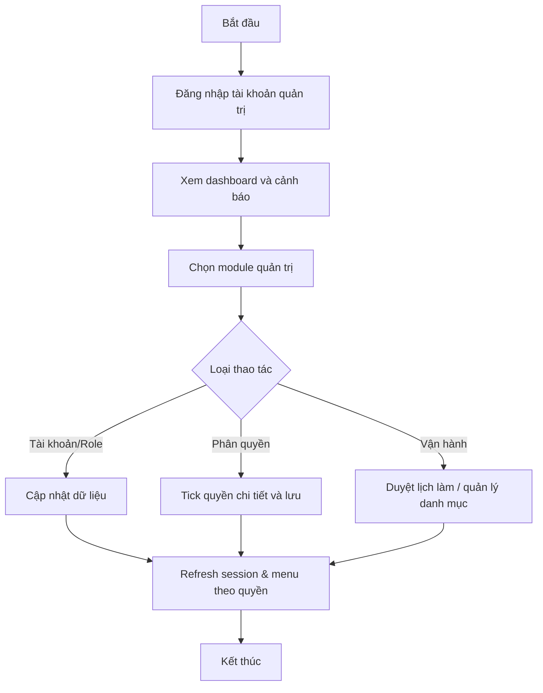

# QuanLyPhongKhamBenh

Ứng dụng desktop Java Swing quản lý phòng khám đa khoa theo mô hình vận hành thực tế: 
- Bệnh nhân tại kiosk/POS không cần đăng nhập vẫn có thể đặt lịch hoặc mua thuốc.
- Bác sĩ xử lý lịch khám, khám bệnh, lập hồ sơ bệnh án và kê đơn thuốc.
- Nhà thuốc quản lý thuốc, nhập kho theo lô, bán thuốc theo đơn hoặc bán lẻ.
- Quản trị viên quản lý tài khoản, vai trò, phân quyền chi tiết và dashboard thống kê.

## Sơ đồ luồng nghiệp vụ tổng quát



---

## 1. Bức tranh tổng thể nghiệp vụ

### 1.1. Luồng Guest (kiosk/POS tại phòng khám)
1. Bệnh nhân chọn đặt lịch khám.
2. Điền thông tin cá nhân, chọn bác sĩ, ngày khám, khung giờ, gói khám.
3. Hệ thống chỉ hiển thị bác sĩ có lịch làm việc hợp lệ và còn slot trống.
4. Sau khi xác nhận, hệ thống tạo mã lịch khám để bệnh nhân dùng khi đến quầy.

Hoặc:
1. Bệnh nhân mua thuốc không cần login.
2. Chọn thuốc, thêm giỏ hàng, nhập thông tin khách.
3. Tạo hóa đơn thuốc và in/xuất chứng từ.

### 1.2. Luồng Bác sĩ
1. Bác sĩ đăng ký lịch làm việc (chờ duyệt).
2. Bác sĩ xác nhận/hủy lịch khám được phân công.
3. Khi khám bệnh:
- Cập nhật hồ sơ bệnh án.
- Ghi triệu chứng, chẩn đoán, kết luận, lời dặn.
- Có thể kê đơn thuốc ngay trong màn hình bệnh án.
4. Đơn thuốc được dùng làm đầu vào để nhà thuốc tạo hóa đơn bán thuốc.

### 1.3. Luồng Nhà thuốc
1. Quản lý danh mục thuốc (thêm/sửa/vô hiệu hóa/kích hoạt).
2. Tạo phiếu nhập, theo dõi chi tiết lô/HSD, xác nhận nhập kho.
3. Bán thuốc:
- Theo đơn thuốc từ bác sĩ.
- Hoặc bán lẻ trực tiếp.
4. Xác nhận thanh toán, xác nhận giao thuốc, theo dõi xuất theo lô.

### 1.4. Luồng Quản trị
1. Xem dashboard vận hành (doanh thu, lịch khám, cảnh báo thuốc).
2. Quản lý tài khoản nhân viên.
3. Quản lý role.
4. Phân quyền chi tiết theo panel/chức năng.

---

## 2. Tính năng nổi bật

- Mô hình phân vai rõ ràng: Guest, Bác sĩ, Nhà thuốc, Quản trị.
- RBAC chi tiết theo mã quyền (xem/thêm/sửa/xóa/xác nhận...).
- Điều hướng động theo quyền: sau login tự vào trang đầu tiên được phép truy cập.
- Kết nối DB qua HikariCP (connection pool) tối ưu hiệu năng.
- Chuẩn hóa trạng thái và quyền để tránh lệch dữ liệu hoa/thường.
- Hỗ trợ xuất file PDF cho một số nghiệp vụ (đặt lịch, hóa đơn...).
- Dashboard có thống kê doanh thu và cảnh báo thuốc sắp hết hạn/tồn thấp.

## Ma trận chức năng theo vai trò

| Nhóm chức năng | Guest | Bác sĩ | Nhà thuốc | Quản trị |
|---|---|---|---|---|
| Đặt lịch khám | Co | - | - | Co (nếu được cấp quyền) |
| Mua thuốc nhanh | Co | - | Co | Co |
| Lịch làm việc bác sĩ | - | Co | - | Co (duyệt) |
| Lịch khám/Hóa đơn khám | - | Co | - | Co (theo quyền) |
| Bệnh án + kê đơn | - | Co | - | Co (theo quyền) |
| Quản lý thuốc/nhập lô/HSD | - | - | Co | Co |
| Quản lý tài khoản/role/phân quyền | - | - | - | Co |
| Dashboard vận hành | - | - | - | Co |

---

## 3. Kiến trúc kỹ thuật

Project đi theo kiến trúc nhiều lớp:

- GUI: giao diện và tương tác người dùng (Swing).
- BUS: nghiệp vụ xử lý trung gian.
- DAO: truy cập dữ liệu (JDBC).
- DTO: mô hình dữ liệu trao đổi giữa các lớp.
- Utils: session, chuẩn hóa trạng thái, export...
- DB: kết nối MySQL qua HikariCP.

Luồng chuẩn:
GUI -> BUS -> DAO -> MySQL

### 3.1. Điều hướng giao diện
- Sử dụng route nội bộ trong giao diện chính (CardLayout).
- Sidebar build menu theo quyền hiện tại.
- MainFrame kiểm tra quyền trước khi cho truy cập route.

### 3.2. Quản lý phiên đăng nhập
- Session lưu currentUser, currentPermissions, currentBacSiID.
- Khi login, quyền được nạp tự động từ DB và chuẩn hóa uppercase.
- Guest không login vẫn có quyền mặc định cho chức năng cơ bản.

---

## 4. Công nghệ và thư viện sử dụng

- Java Swing
- FlatLaf
- MySQL Connector/J
- HikariCP
- JCalendar
- iTextPDF
- Apache POI
- SLF4J

Thư viện nằm tại thư mục lib của project.

---

## 5. Cấu trúc thư mục chính

- src/main/java/phongkham/Main.java: entry point
- src/main/java/phongkham/gui: toàn bộ giao diện theo module
- src/main/java/phongkham/BUS: business logic
- src/main/java/phongkham/dao: data access
- src/main/java/phongkham/DTO: data transfer objects
- src/main/java/phongkham/db: cấu hình kết nối database
- src/main/java/phongkham/Utils: session, export, helper
- database: script SQL dựng dữ liệu
- lib: external jars

---

## 6. Cài đặt và chạy project

### 6.1. Yêu cầu môi trường
- JDK 17+
- MySQL 8+ (hoặc endpoint MySQL cloud)
- VS Code + Extension Pack for Java (khuyến nghị)

### 6.2. Chuẩn bị dữ liệu
1. Tạo database PhongKham.
2. Chạy một trong hai script trong thư mục database:
- PhongKham_rebuild_2026-03-18.sql
- PhongKham_rebuild_essential_2026-03-25.sql

### 6.3. Cấu hình kết nối DB
Project có giá trị mặc định trong DBConnection, nhưng khuyến nghị override bằng biến môi trường:

- DB_URL
- DB_USER
- DB_PASS

Ví dụ DB_URL:

```text
jdbc:mysql://host:port/PhongKham?sslMode=REQUIRED&allowPublicKeyRetrieval=true&serverTimezone=Asia/Ho_Chi_Minh
```

### 6.4. Chạy ứng dụng
Cách đơn giản nhất trong VS Code:
1. Mở file Main.java.
2. Bấm Run Java.
3. Ứng dụng mở ở màn Login.

---

## 7. Mô tả module theo màn hình

### 7.1. Auth
- Login nhân viên.
- Login Guest để vào luồng kiosk.

### 7.2. Guest
- Đặt lịch khám.
- Mua thuốc nhanh.

### 7.3. Bác sĩ
- Lịch làm việc.
- Lịch khám.
- Hóa đơn khám.
- Hồ sơ bệnh án + đơn thuốc.
- Hồ sơ cá nhân bác sĩ.

### 7.4. Nhà thuốc
- Quản lý thuốc.
- Nhà cung cấp.
- Phiếu nhập và lô/HSD.
- Hóa đơn thuốc.

### 7.5. Quản trị
- Dashboard.
- Quản lý tài khoản / role / phân quyền chi tiết (gộp trong panel quản lý).
- Quản lý bác sĩ.
- Duyệt lịch làm.
- Quản lý khoa.
- Quản lý gói dịch vụ.

---

## 8. Điểm mạnh cho demo đồ án

- Mô phỏng sát quy trình thật của phòng khám đa khoa.
- Có cả luồng không đăng nhập cho bệnh nhân tại kiosk.
- RBAC chi tiết, thực tế, mở rộng dễ.
- Quản lý tồn kho theo lô và hạn sử dụng.
- Liên thông dữ liệu giữa khám bệnh, đơn thuốc và nhà thuốc.
- Dashboard có số liệu vận hành phục vụ quản trị.

---

## 9. Hướng phát triển tiếp theo

- Tách cấu hình môi trường thành file config riêng theo profile dev/staging/prod.
- Thêm audit log cho các thao tác nhạy cảm (xác nhận thanh toán, hủy hóa đơn...).
- Tăng cường validation nghiệp vụ theo transaction ở các luồng nhập/xuất.
- Bổ sung test tự động cho BUS/DAO.
- Đồng bộ hóa tài liệu API nếu mở rộng sang web/mobile.

---

## 10. Ghi chú bảo mật

- Không nên hard-code thông tin DB trong mã nguồn khi deploy thực tế.
- Nên sử dụng biến môi trường hoặc secret manager.
- Không commit credential thật lên repository public.

---

## 11. Sơ đồ Use Case + Activity theo vai trò

### 11.1. Guest (Bệnh nhân tại kiosk/POS)

Use Case:



Activity:



### 11.2. Bác sĩ

Use Case:



Activity:



### 11.3. Nhà thuốc

Use Case:



Activity:



### 11.4. Quản trị

Use Case:



Activity:



---

## 12. FAQ khi demo (DB, quyền, trạng thái hóa đơn)

### 12.1. Lỗi kết nối DB

Q1: Mở app bị báo lỗi kết nối hoặc đứng ở màn đăng nhập?

- Nguyên nhân thường gặp:
- Sai DB_URL, DB_USER, DB_PASS.
- DB server chưa chạy hoặc bị chặn mạng.
- SSL/Timezone không đúng tham số.
- Cách xử lý nhanh:
- Kiểm tra thông tin trong DBConnection hoặc biến môi trường DB_URL, DB_USER, DB_PASS.
- Dùng đúng format JDBC có timezone và sslMode.
- Test kết nối DB bằng MySQL Workbench trước khi chạy app.

Q2: Báo Access denied for user?

- Nguyên nhân thường gặp:
- Sai user/password.
- User chưa được cấp quyền vào schema PhongKham.
- Cách xử lý nhanh:
- Cấp quyền SELECT/INSERT/UPDATE/DELETE cho user trên schema.
- Kiểm tra host cho phép kết nối (local/remote).

### 12.2. Lỗi quyền và menu chức năng

Q3: Đăng nhập thành công nhưng không thấy menu mong muốn?

- Nguyên nhân thường gặp:
- Role chưa được cấp quyền chi tiết trong phân quyền.
- Session chưa refresh sau khi vừa thay đổi quyền.
- Cách xử lý nhanh:
- Vào panel Phân quyền chi tiết, kiểm tra mã quyền tương ứng.
- Đăng xuất và đăng nhập lại để nạp lại permission.
- Kiểm tra role của user trong bảng Users.

Q4: Nút bị ẩn hoặc không bấm được dù đã vào đúng màn?

- Nguyên nhân thường gặp:
- Mỗi nút kiểm tra quyền riêng (XEM/THEM/SUA/XOA/XAC_NHAN...).
- Cách xử lý nhanh:
- Cấp đủ quyền mức hành động, không chỉ quyền xem màn hình.

### 12.3. Lỗi trạng thái hóa đơn khi thao tác

Q5: Vì sao không xác nhận thanh toán/hủy được hóa đơn khám?

- Quy tắc chính:
- Hóa đơn đã hủy thì không xác nhận thanh toán lại.
- Hóa đơn đã thanh toán thì không hủy.
- Cách xử lý nhanh:
- Kiểm tra trạng thái hiện tại trước khi thao tác.
- Làm đúng thứ tự nghiệp vụ: chưa thanh toán -> thanh toán -> hoàn tất.

Q6: Vì sao không xác nhận giao thuốc cho hóa đơn thuốc?

- Quy tắc chính:
- Chỉ giao khi hóa đơn ở trạng thái đã thanh toán chờ lấy.
- Nếu chưa thanh toán hoặc đã hủy/hoàn tiền thì không giao được.
- Cách xử lý nhanh:
- Xác nhận thanh toán trước.
- Sau đó mới xác nhận giao thuốc.
- Nếu cần, mở chi tiết để kiểm tra trạng thái thanh toán và trạng thái lấy thuốc.

Q7: Hóa đơn thuốc tạo được nhưng không xuất kho đúng?

- Nguyên nhân thường gặp:
- Dữ liệu tồn kho theo lô không đủ.
- Phiếu nhập chưa ở trạng thái đã nhập kho.
- Cách xử lý nhanh:
- Kiểm tra màn Phiếu nhập và trạng thái DA_NHAP.
- Kiểm tra số lượng còn lại theo lô/HSD.

---
